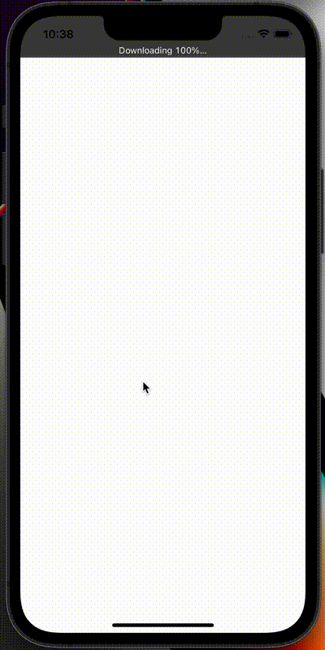

React Native Reanimated 2 Cards Layout Animation Example 🗂

<h1 align="center">Reanimated Cards Layout</h1>
 

Please read the [React Native Reanimated 2 Layout Animation Example](https://dev.to/vladimirvovk/react-native-reanimated-2-layout-animations-example-3i0h) article for details.

</img>

## Installation

1. Clone the repo.
2. Change directory to the app: `cd reanimated-cards-layout`.
3. Install all dependencies: `yarn install`.
4. Run the Metro: `yarn start`.
5. Build the app and run in simulator: `yarn ios`.
